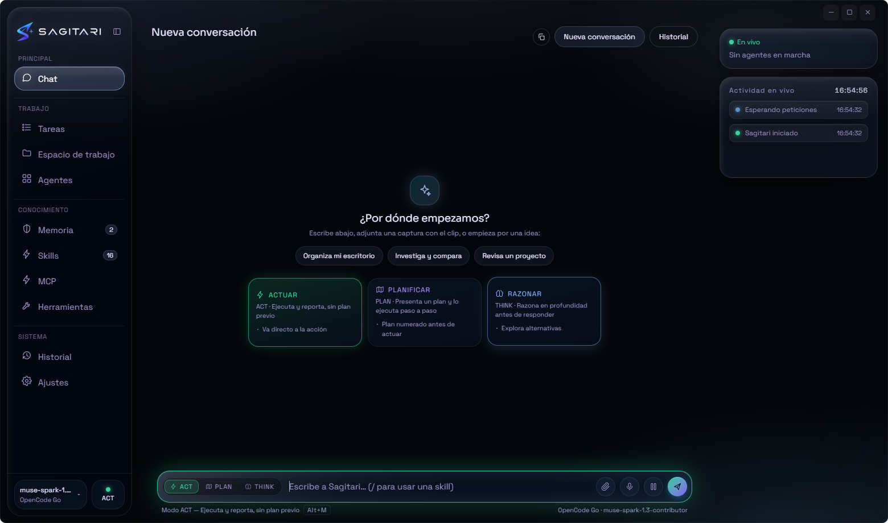

<div align="center">


# SAGITARI

### Your desktop AI agent — with hands.

**Ask in natural language. SAGITARI plans, acts, and reports back on your Windows PC.**

[](https://github.com/dario90vlc/sagitari/releases)
[](https://github.com/dario90vlc/sagitari/releases)
[](https://github.com/dario90vlc/sagitari/releases)
[](LICENSE)

[Download](#download) · [Features](#what-it-does) · [Security](#safety-first) · [Build](#build-from-source) · [Español](./README.es.md)

</div>

---

## Why SAGITARI?

Most desktop AI assistants stop at the chat box. SAGITARI is built to **finish the job**: it can use your terminal, work with files, drive Chrome or Edge, open apps, manage windows, and keep you informed at every step.

It is local-first by design. You choose the model and provider — cloud or local — while configuration, API keys, conversations, logs, memory, and browser profiles stay on your machine.

> **Natural language in. Real work out.**

## Download

The recommended option is the Windows installer:

| Package | Description |
|---|---|
| [**SAGITARI-Setup-3.1.0.exe**](https://github.com/dario90vlc/sagitari/releases/download/v3.1.0/SAGITARI-Setup-3.1.0.exe) | Installer with shortcuts and uninstaller |
| [**SAGITARI-Portable-3.1.0.exe**](https://github.com/dario90vlc/sagitari/releases/download/v3.1.0/SAGITARI-Portable-3.1.0.exe) | Single executable, no installation |
| [**Release notes**](https://github.com/dario90vlc/sagitari/releases/tag/v3.1.0) | Changes, security fixes, and SHA-256 hashes |

> **Windows SmartScreen:** the binaries are currently unsigned, so Windows may show a warning on the first run. Choose *More info → Run anyway* if you trust the download. Verify the SHA-256 hash published in the release notes.

> **Voice engines:** the local neural voice (Piper) and the high-accuracy local dictation (Whisper) are **not** bundled in the installer —they are downloaded on demand from Settings, about 270 MB in total— so the download stays light and voice mode still works with the Windows engines until you install them.

## What it does

### An agent that executes

- **Terminal and files** — inspect, create, edit, and organize work in your filesystem.
- **Browser automation** — control Chrome or Edge through DevTools Protocol: navigate, click, type, read, manage tabs, and capture screenshots.
- **Desktop actions** — open applications and URLs, manage windows, clipboard, notifications, and multimedia.
- **Vision and attachments** — attach images, code, documents, and text files; images can be sent to vision-capable models.

### Flexible intelligence

- **Bring your own model** — OpenCode Go, OpenRouter, OpenAI, Groq, Anthropic, Ollama, LM Studio, or any compatible endpoint.
- **Think / Plan / Act** — reason deeply, prepare a plan before acting, or execute directly.
- **Skills** — import specialized `SKILL.md` packs and load their instructions on demand instead of bloating every prompt.
- **MCP servers** — Connect your own MCP servers (local commands or remote URLs) and the agent uses their tools like built-in ones. Everything they run asks for permission first, and you can promote a server you trust.
- **Memory and habits** — keep useful context across conversations, locally.
- **Fallbacks and recovery** — model fallback, background tasks, checkpoints, pause/resume, and recovery after interruptions. If a provider accepts the connection but stops sending data, the turn cuts itself off (configurable limit in Settings › Security) and the error is explained in the chat. The model chosen in Settings wins: the router no longer swaps it silently.

### A UI that shows the work

- Holographic interface built with vanilla HTML, CSS, and JavaScript.
- Reactive frame glow while the agent thinks, works, listens, or speaks.
- Six accent palettes plus live glow color and intensity controls.
- Separate conversations, live agent telemetry, structured local run logs, and optional developer metrics.
- Voice input through Windows speech recognition and text-to-speech output.
- **Voice mode**: press the mic and talk; the assistant hears you, does the work and answers out loud. Hands-free: it sends when you stop talking, it shows you the text while you speak and starts answering out loud as soon as it has the first sentence instead of waiting for the whole reply. If you speak while it talks, it shuts up and listens; and you can stop it by saying “para” or with the panel's **Parar** button. Everything stays on your machine, with a local neural voice (Piper) and high-accuracy local dictation (Whisper) installable from Settings. `Alt`+click on the mic keeps the classic dictation into the text box.

## Safety first

SAGITARI gives an agent real access to your computer, so safety is part of the product:

- **Permission levels per tool** — safe actions can run automatically; sensitive actions ask first.
- **MCP tools** — follow the same permission engine: confirmation by default, per-server and per-tool levels, and their credentials are stored encrypted like your API keys.
- **Mandatory confirmation for sensitive browser operations** such as clipboard access, page JavaScript, and profile changes.
- **Guardrails** for steps, tool calls, duration, tokens, cost, loops, and stalled work.
- **Real stop control** — stopping a run also cancels the process behind it where possible.
- **Restricted subagents** — each specialist receives only the tools it is allowed to use.
- **Local data** — no account and no telemetry; API keys are stored using the Windows system keystore when available.
- **Verified updates** — downloaded updates require the published SHA-512 and are checked again before installation.

## Quick start

1. Install SAGITARI or download the portable build.
2. Open **Settings** and choose a provider preset.
3. Enter your API key if that provider needs one, detect models, and activate a model.
4. Return to **Chat** and ask for something real.

Useful shortcuts:

| Shortcut | Action |
|---|---|
| `Alt+1…9` | Switch sections |
| `Ctrl+Alt+S` | Show or hide the panel |
| `Alt+Shift+S` | Bring SAGITARI to the front |
| `Ctrl+Shift+G` | Trigger a glow pulse |
| `Alt+M` | Cycle ACT → PLAN → THINK |
| `/` in chat | Open the skills palette |

## Screenshots

<table>
  <tr>
    <td width="50%"></td>
    <td width="50%"></td>
  </tr>
  <tr>
    <td align="center"><sub><b>Chat</b> — ask, attach, and execute</sub></td>
    <td align="center"><sub><b>Modes</b> — choose Act, Plan, or Think</sub></td>
  </tr>
  <tr>
    <td width="50%"></td>
    <td width="50%"></td>
  </tr>
  <tr>
    <td align="center"><sub><b>Agents</b> — follow every run</sub></td>
    <td align="center"><sub><b>Tools</b> — understand what the agent can do</sub></td>
  </tr>
</table>

## Build from source

Requirements: **Windows 10/11** and **Node.js 20+**.

```bash
git clone https://github.com/dario90vlc/sagitari.git
cd sagitari
npm ci

npm start                 # run the app
npm test                  # unit and integration tests
npm run smoke             # verify that Electron starts
npm run uicheck           # exercise the live renderer
npm run dist              # build NSIS installer + portable executable
```

The release workflow runs syntax checks, tests, smoke, UI checks, builds both Windows artifacts, verifies the output, generates release notes, and publishes SHA-256 hashes. The release tag must match the version in `package.json` — for this release, `v3.1.0`.

## Project structure

```text
sagitari/
├── main/           Electron main process, windows, IPC, voice, providers
├── agent/          Agent loop, tools, guardrails, memory, skills, tasks, browser
├── renderer/       Vanilla HTML/CSS/JS interface
├── skills-starter/ Bundled starter skills
├── scripts/        Diagnostics, UI checks, and asset tools
└── docs/           Screenshots and project artwork
```

## Privacy

- Configuration, API keys, conversations, logs, memory, and browser profiles live under `%APPDATA%\SagitariAI\`.
- Provider keys go directly from your local app to your selected provider.
- Local providers such as Ollama can run without sending data to a cloud service.
- The renderer uses `contextIsolation`, disables Node integration, and runs sandboxed.

## License

SAGITARI is free software released under the [MIT License](LICENSE).

<div align="center">

**Built for people who want an assistant that does more than talk.**

[⬆ Back to top](#sagitari)

</div>
