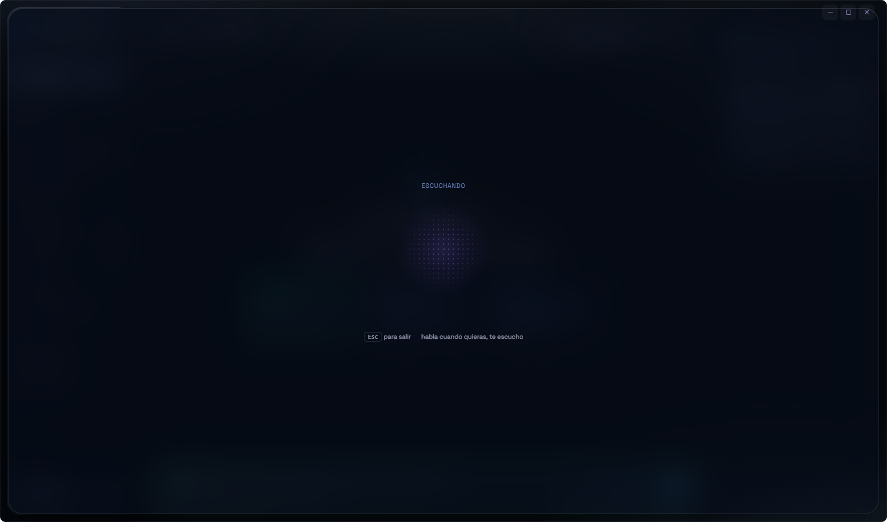
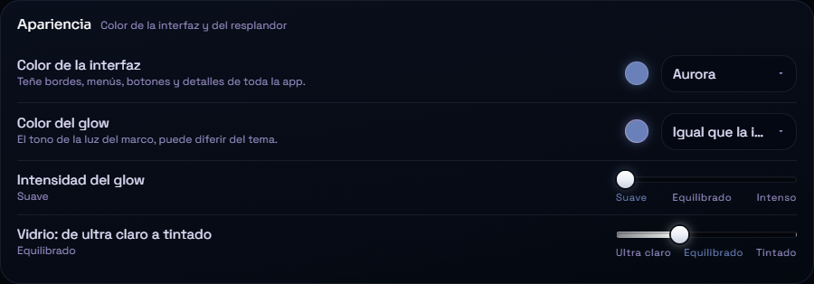
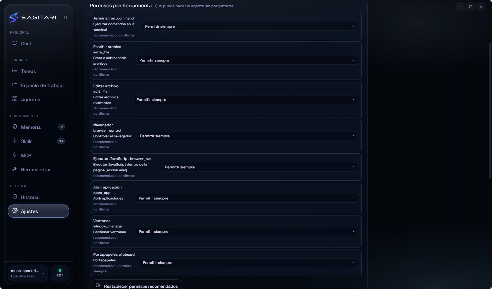

<div align="center">


# SAGITARI

### Your desktop AI agent — with hands.

**Ask in natural language. SAGITARI plans, acts, and reports back on your Windows PC.**

[](https://github.com/dario90vlc/sagitari/releases)
[](https://github.com/dario90vlc/sagitari/releases)
[](https://github.com/dario90vlc/sagitari/releases)
[](LICENSE)

[](https://github.com/dario90vlc/sagitari/releases/latest)

[Download](#download) · [Features](#what-it-does) · [Security](#safety-first) · [Español](./README.es.md)

**Natural language in. Real work out.** — SAGITARI uses your terminal, your files, and your browser to finish the job, while everything stays on your machine.

</div>

---

## See it work

<table>
  <tr>
    <td width="50%"></td>
    <td width="50%"></td>
  </tr>
  <tr>
    <td align="center"><sub><b>Chat</b> — plans, runs, and reports back</sub></td>
    <td align="center"><sub><b>Fresh start</b> — a clean canvas, your accent</sub></td>
  </tr>
  <tr>
    <td width="50%"></td>
    <td width="50%"></td>
  </tr>
  <tr>
    <td align="center"><sub><b>Voice mode</b> — talk; it works and answers aloud</sub></td>
    <td align="center"><sub><b>Appearance</b> — aura, glass, yours to tune</sub></td>
  </tr>
  <tr>
    <td width="50%"></td>
    <td width="50%"></td>
  </tr>
  <tr>
    <td align="center"><sub><b>Agents</b> — every run, live</sub></td>
    <td align="center"><sub><b>Permissions</b> — nothing sensitive without your OK</sub></td>
  </tr>
</table>

---

## Why SAGITARI?

Most desktop AI assistants stop at the chat box. SAGITARI is built to **finish the job**: it can use your terminal, work with files, drive Chrome or Edge, open apps, manage windows, and keep you informed at every step.

It is local-first by design. You choose the model and provider — cloud or local — while configuration, API keys, conversations, logs, memory, and browser profiles stay on your machine.

## What it does

### It executes.

Terminal, files, apps, windows, and a real browser — one instruction, and the work is done on your PC.

<details>
<summary><b>Full breakdown</b></summary>

- **Terminal and files** — inspect, create, edit, and organize work in your filesystem.
- **Desktop actions** — open applications and URLs, manage windows, clipboard, notifications, and multimedia.
- **Browser v2** — drives Chrome or Edge like a person: an inventory with each control's **accessible name** (even icon-only buttons), inside **web components and iframes**, clicks re-located by fingerprint that warn when something covers them, real waits (`wait_for`), console and network errors (`logs`), dialogs, file uploads, keyboard shortcuts, lists and checkboxes, history, and downloads into a known folder.
- **Parallel work** — orders in the same message run at once behind **per-resource locks**: there is only one browser, disk writes queue up, and Stop kills everything in flight.
- **Code with a safety net** — it knows how **your** project is verified (tests, build, lint) and syntax-checks every file as it writes it, so the error comes back right away instead of three steps later. `apply_patch` makes several edits across several files at once (all of them or none) and, before handing you anything as done, a **review agent** reads the turn's diff looking for what's wrong (broken contracts, missed edge cases, leftovers of the old name). Turn it off in Settings ▸ Delegation and verification.
- **Project map** — on large projects it indexes files and symbols (`repo_map`, `find_symbol`) instead of reading them one by one, so it doesn't get lost in 100,000 lines or settle for four local edits.

</details>

### It thinks your way.

Reason deeply, plan before acting, or go direct — with the model of your choice, cloud or local.

<details>
<summary><b>Full breakdown</b></summary>

- **Bring your own model** — OpenCode Go, OpenRouter, OpenAI, Groq, Anthropic, Ollama, LM Studio, or any compatible endpoint.
- **Think / Plan / Act** — reason deeply, prepare a plan before acting, or execute directly.
- **Skills** — import specialized `SKILL.md` packs and load their instructions on demand instead of bloating every prompt.
- **MCP servers** — Connect your own MCP servers (local commands or remote URLs) and the agent uses their tools like built-in ones. Everything they run asks for permission first, and you can promote a server you trust.
- **Memory and habits** — keep useful context across conversations, locally.
- **Fallbacks and recovery** — model fallback, background tasks, checkpoints, pause/resume, and recovery after interruptions. If a provider accepts the connection but stops sending data, the turn cuts itself off (configurable limit in Settings › Security) and the error is explained in the chat. The model chosen in Settings wins: the router no longer swaps it silently.

</details>

### It shows the work.

Every step, tool, and second on screen — and it can read the answer out loud.

<details>
<summary><b>Full breakdown</b></summary>

- Holographic interface built with vanilla HTML, CSS, and JavaScript.
- Reactive frame glow while the agent thinks, works, listens, or speaks.
- Six accent palettes plus live glow color and intensity controls.
- Separate conversations, live agent telemetry, structured local run logs, and optional developer metrics.
- Voice input through Windows speech recognition and text-to-speech output.
- **Visible reasoning (optional)**: reasoning models (Claude, the o-series and GPT-5, DeepSeek R1…) show their thinking in a collapsible block above the answer; it streams live while they think, folds itself as soon as they start answering, and is never read out loud. Turn it on in Settings ▸ Agent.
- **Voice mode**: press the mic and talk; the assistant hears you, does the work and answers out loud. Hands-free: it sends when you stop talking, it shows you the text while you speak and starts answering out loud as soon as it has the first sentence instead of waiting for the whole reply. If you speak while it talks, it shuts up and listens; and you can stop it by saying “para” or with the panel's **Parar** button. Everything stays on your machine, with a local neural voice (Piper) and high-accuracy local dictation (Whisper) installable from Settings. `Alt`+click on the mic keeps the classic dictation into the text box.

</details>

## Safety first

SAGITARI gives an agent real access to your computer, so safety is part of the product:

- **Permission levels per tool** — safe actions can run automatically; sensitive actions ask first.
- **MCP tools** — follow the same permission engine: confirmation by default, per-server and per-tool levels, and their credentials are stored encrypted like your API keys.
- **Mandatory confirmation for sensitive browser operations** such as clipboard access, page JavaScript, and profile changes.
- **Guardrails** for steps, tool calls, duration, tokens, cost, loops, and stalled work.
- **Real stop control** — stopping a run also cancels the process behind it where possible.
- **Restricted subagents** — each specialist receives only the tools it is allowed to use.
- **Local data** — no account and no telemetry; API keys are stored using the Windows system keystore when available.
- **Verified updates** — downloaded updates require the published SHA-512 and are checked again before installation.
- **Two-click consent for unsigned updates and new skills** — installing an update without a digital signature, or importing skills from GitHub (instructions your agent will obey), shows you what is coming first and only proceeds when you click again.

## Quick start

1. [Download SAGITARI](https://github.com/dario90vlc/sagitari/releases/latest) — installer or portable single `.exe`.
2. Open **Settings** and choose a provider preset.
3. Enter your API key if that provider needs one, detect models, and activate a model.
4. Return to **Chat** and ask for something real.

Useful shortcuts:

| Shortcut | Action |
|---|---|
| `Alt+1…9` | Switch sections |
| `Ctrl+Alt+S` | Show or hide the panel |
| `Alt+Shift+S` | Bring SAGITARI to the front |
| `Ctrl+Shift+G` | Trigger a glow pulse |
| `Alt+M` | Cycle ACT → PLAN → THINK |
| `/` in chat | Open the skills palette |

## Download

| Package | Description |
|---|---|
| [**⬇ Download SAGITARI for Windows**](https://github.com/dario90vlc/sagitari/releases/latest) | Installer (shortcuts + uninstaller) and portable single `.exe` |
| [**Release notes**](https://github.com/dario90vlc/sagitari/releases) | Changes, security fixes, and SHA-256 hashes |

> **Windows SmartScreen:** the binaries are currently unsigned, so Windows may show a warning on the first run. Choose *More info → Run anyway* if you trust the download. Verify the SHA-256 hash published in the release notes.

> **Voice engines:** the local neural voice (Piper) and the high-accuracy local dictation (Whisper) are **not** bundled in the installer —they are downloaded on demand from Settings, about 700 MB in total— so the download stays light and voice mode still works with the Windows engines until you install them.

## Privacy

- Configuration, API keys, conversations, logs, memory, and browser profiles live under `%APPDATA%\SagitariAI\`.
- Provider keys go directly from your local app to your selected provider.
- Local providers such as Ollama can run without sending data to a cloud service.
- The renderer uses `contextIsolation`, disables Node integration, and runs sandboxed.

<details>
<summary><b>Project structure</b></summary>

```text
sagitari/
├── main/           Electron main process, windows, IPC, voice, providers
├── agent/          Agent loop, tools, guardrails, memory, skills, tasks, browser
├── renderer/       Vanilla HTML/CSS/JS interface
├── skills-starter/ Bundled starter skills
├── scripts/        Diagnostics, UI checks, and asset tools
└── docs/           Screenshots and project artwork
```

</details>

## License

SAGITARI is free for personal use —100% free, forever, with no fees ever.
Its source code may be reviewed, but it may not be compiled, redistributed,
replicated or used by companies, and the SAGITARI name and logo are
trademarks of its author. Full terms in the
[SAGITARI Personal Use License](LICENSE).

<div align="center">

**Built for people who want an assistant that does more than talk.**

[⬆ Back to top](#sagitari)

</div>
