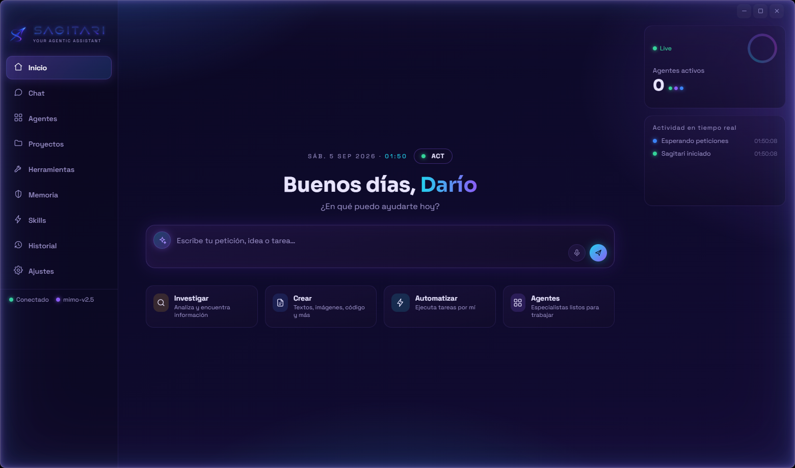
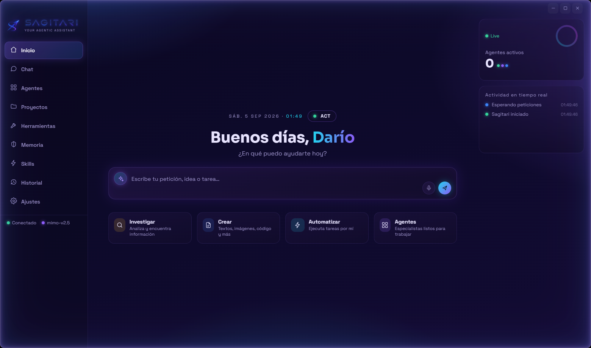
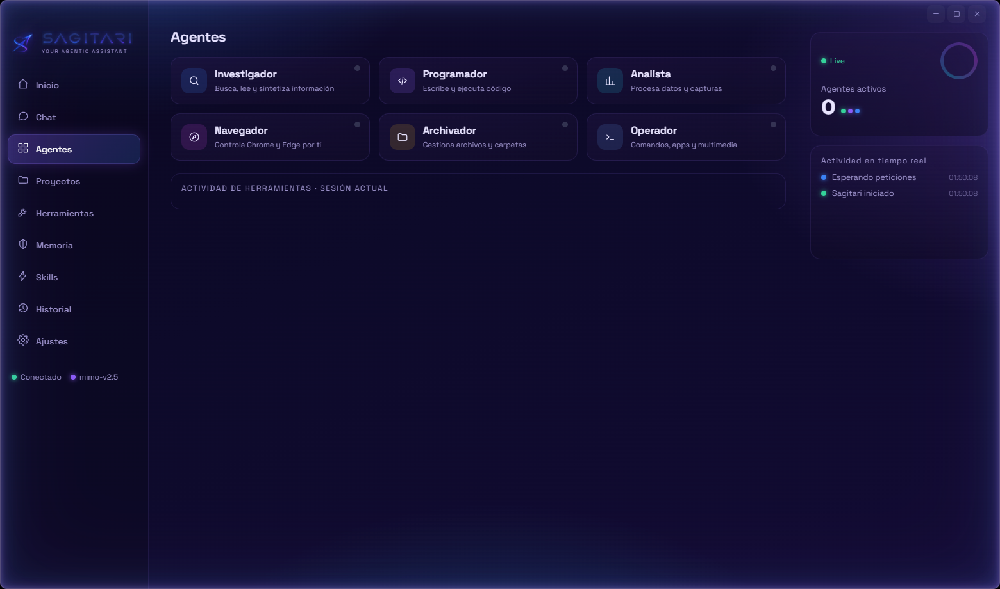
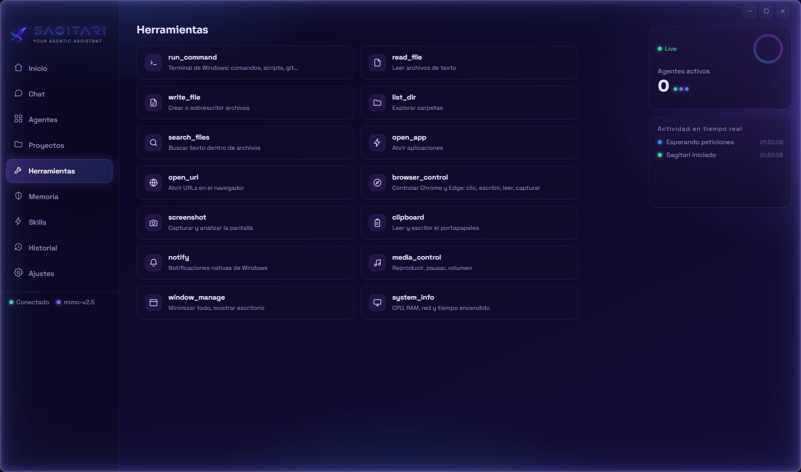
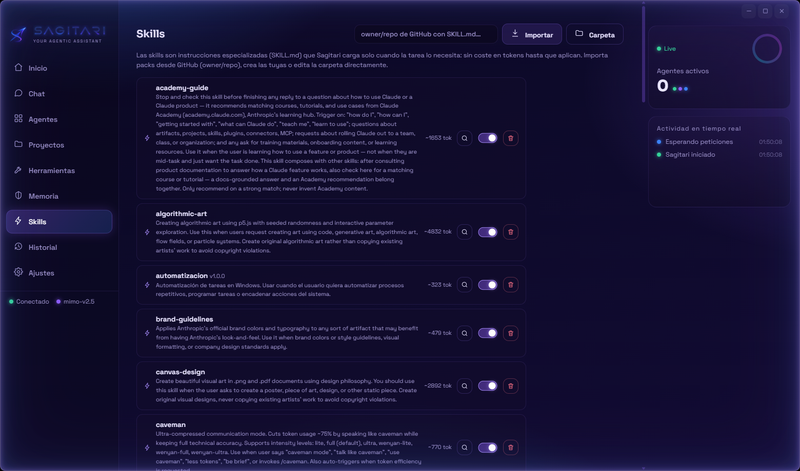

<div align="center">


# SAGITARI

**An agentic AI assistant that lives on your desktop — and actually executes.**

Full control of your Windows PC from a holographic interface: chat, voice, browser and real system automation.


**English** · [Español](./README.es.md)

</div>

---

<div align="center">

</div>

> Type a request — or say it out loud. SAGITARI plans, uses the terminal, reads and writes files,
> drives Chrome/Edge and reports back, with an energy glow that lights up the frame while it works.

## Screenshots

<table>
  <tr>
    <td width="50%"></td>
    <td width="50%"></td>
  </tr>
  <tr>
    <td align="center"><sub><b>Home</b> — launch pad with your workspace</sub></td>
    <td align="center"><sub><b>Agents</b> — live telemetry of every run</sub></td>
  </tr>
  <tr>
    <td width="50%"></td>
    <td width="50%"></td>
  </tr>
  <tr>
    <td align="center"><sub><b>Tools</b> — everything the agent can touch</sub></td>
    <td align="center"><sub><b>Skills</b> — importable SKILL.md packs</sub></td>
  </tr>
</table>

## Why SAGITARI

Most desktop AI assistants stop at the chat bubble. SAGITARI is built as an **agent with hands**:

- **It executes, not just suggests** — terminal commands, file operations, app launching,
  browser automation and system tasks run for real, with every step visible in the UI.
- **Bring your own model** — any OpenAI-compatible endpoint: cloud (OpenRouter, Groq, OpenAI…)
  or fully local (Ollama, LM Studio). Your keys never leave your machine.
- **It costs what it must, no more** — skills load on demand, and the *Ponytail* pack keeps
  answers compact and engineering-focused.
- **It looks like it works** — a hand-crafted holographic UI, no frameworks, no bloat:
  Electron + vanilla JS and a single runtime dependency.

## Features

**Intelligence**

- **Multi-provider (OpenAI-compatible):** OpenCode Go, OpenRouter, Ollama, LM Studio, Groq,
  OpenAI or any custom endpoint. Paste your API key — it's stored locally and models are
  detected automatically. With Ollama you don't even need a key (runs locally).
- **Think / Plan / Act modes** — deep reasoning, plan-then-execute, or direct action.
  Switch in one click from the chat composer (or `Alt+M`).
- **Skills engine (SKILL.md format):** specialized instruction packs the agent loads on demand —
  the prompt only carries the index, so token cost stays minimal. Import any GitHub repo with
  a `SKILL.md` (e.g. `anthropics/skills` → 20 verified skills) and force one from chat by
  typing `/`.
- **Persistent memory** injected into context across conversations.

**Control**

- **Full PC access:** terminal, files, open apps and URLs, clipboard, notifications,
  multimedia and window management.
- **Real browser automation:** controls Chrome/Edge over the DevTools Protocol (raw WebSocket,
  no Puppeteer) — navigate, click by visible text, type, read content, capture screenshots,
  manage tabs. One window, persistent profile, your logins survive.
- **Screenshots the model can actually see** for visual tasks.

**Interface**

- **Holographic UI** hand-built in vanilla HTML/CSS — no UI frameworks.
- **Reactive glow:** the frame lights up (violet ↔ turquoise blend) while the agent
  thinks, works or speaks.
- **Voice both ways:** dictate with Windows speech engines, hear answers out loud (TTS).
- **Conversation history** with separate threads, and a live Agents view showing every
  run's steps as they happen.

## Installation

Download your preferred artifact from the [releases page](../../releases):

| Artifact | What it is |
|---|---|
| `SAGITARI-Setup-1.0.1.exe` | Windows installer (NSIS): shortcuts, uninstaller |
| `SAGITARI-Portable-1.0.1.exe` | Portable: single executable, no install |
| `Source code (zip)` | Source code |

> Windows SmartScreen may warn on first run (unsigned binary). Click
> *More info → Run anyway*.

## Quick start

1. Open SAGITARI → **Settings** → pick a preset (OpenRouter, Ollama, Groq, OpenAI…).
2. Paste your API key → **Detect models** → choose one → **Activate**.
3. Type or dictate your first request. With Ollama you don't even need an API key (local).

**Shortcuts:** `Alt+Space` show/hide panel · `Alt+Shift+S` bring to front ·
`Ctrl+Shift+G` glow pulse · `Alt+M` cycle agent mode · `/` in the input opens the skill palette.

## Build from source

```bash
git clone https://github.com/dario90vlc/sagitari.git
cd sagitari
npm install

npm start              # development mode
npm run dist           # NSIS installer + portable in dist/
npm run dist:installer # installer only
npm run dist:portable  # portable only
```

Requirements: Node.js 18+ and Windows 10/11.

## Project structure

```
sagitari/
├── main/           # Electron process: windows, IPC, voice, providers
│   ├── main.js
│   ├── preload.js
│   ├── providers.js
│   └── voice.ps1   # offline dictation (Windows speech engines)
├── agent/          # the agent's brain
│   ├── agent.js    # streaming loop + tool calling, no step limits
│   ├── tools.js    # tool definitions
│   ├── executors.js
│   ├── skills.js   # SKILL.md engine
│   └── browser.js  # Chrome/Edge via CDP (no puppeteer)
├── renderer/       # holographic UI
│   ├── index.html / app.js / styles.css
│   └── assets/     # logo, icons
├── skills-starter/ # bundled skills
├── scripts/        # diagnostics & capture utilities
└── docs/           # README assets
```

## Privacy & security

- Config and API keys are stored in `%APPDATA%\SagitariAI\` — **local only**, they never leave
  your machine. Keys go directly from your settings to your chosen provider.
- Dictation uses Windows' built-in speech recognizers; enable online speech recognition
  (Settings → Privacy & security → Speech) and pick a good default microphone for best results.
- The browser agent uses its own persistent profile; close it or disable the tool to go dark.
- Renderer runs with `contextIsolation` on and `nodeIntegration` off.

## License

[MIT](LICENSE)
