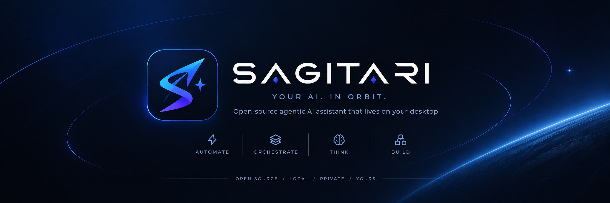

<div align="center">



# SAGITARI

**Open-source agentic AI assistant that lives on your desktop**

Full control of your Windows PC from a holographic interface — chat, voice, browser and real system automation.

`Windows 10/11` · `Electron` · `Multi-provider` · `MIT License`

**English** · [Español](./README.es.md)

[Download](#installation) · [Quick start](#quick-start) · [Skills](#skills) · [Build](#build-from-source)

</div>

---

SAGITARI is a Jarvis-style assistant that **actually executes**: it doesn't just chat — it uses the
terminal, reads and writes files, opens apps, controls Chrome/Edge, handles media and automates
tasks — all from a holographic control panel with an energy glow that reacts when it thinks and acts.

## Features

- **Multi-provider (OpenAI-compatible):** OpenCode Go, OpenRouter, Ollama, LM Studio, Groq,
  OpenAI or any custom endpoint. Paste your API key — it's stored locally and models are
  detected automatically.
- **Think / Plan / Act modes** — reasoned, planned or direct.
- **Chat + voice:** type or speak (Windows speech engines) and SAGITARI answers out loud (TTS).
- **Agent glow:** the frame's energy lights up when it responds (violet ↔ turquoise blend) —
  thinking, working and speaking with its own light.
- **Full PC control:** terminal, files, open apps/URLs, clipboard, notifications, screenshots
  the model can "see", media and windows.
- **Real browser:** controls Chrome/Edge via DevTools Protocol (navigate, click, type, read
  content, capture tabs) — no Puppeteer, raw WebSocket.
- **Workspace:** a fixed working folder (configurable in Settings or from Projects); relative
  paths, new files and terminal commands resolve there by default.
- **Conversation history** with separate threads and persistent memory injected into context.
- **Views:** Home, Chat, Agents (live), Projects, Tools, Memory, Skills and Settings.

## Skills

Specialized instructions in **SKILL.md** style (GitHub's agent skills format) that the agent
loads on its own when the task needs them — the prompt only carries the index (name +
description), so token cost is minimal.

- Ships with 5 built in: `codigo` (coding), `investigacion` (research), `diseno` (design),
  `automatizacion` (automation) and the **Ponytail** pack (lazy-senior development, review,
  audit and *caveman* compressed-answer mode).
- **Import from GitHub:** in the Skills view, paste `owner/repo` (or `owner/repo/folder`) from
  any repo with a SKILL.md — e.g. `anthropics/skills` (imports 20 verified skills).
- Create/edit/enable/disable from the UI or by editing `%APPDATA%\SagitariAI\skills\`.
- The agent applies them automatically when relevant, or you can force them from chat by typing
  `/` (skill palette with filtering) — e.g. `/investigacion compare RTX 5080 vs 4090`.

## Installation

Download your preferred artifact from the [releases page](../../releases):

| Artifact | What it is |
|---|---|
| `SAGITARI-Setup-1.0.0.exe` | Windows installer (NSIS): shortcuts, uninstaller |
| `SAGITARI-Portable-1.0.0.exe` | Portable: single executable, no install |
| `Source code (zip)` | Source code |

> Windows SmartScreen may warn on first run (unsigned binary). Click
> *More info → Run anyway*.

## Quick start

1. Open SAGITARI → **Settings** → pick a preset (OpenRouter, Ollama, Groq, OpenAI…).
2. Paste your API key → **Detect models** → choose one → **Activate**.
3. Type or dictate your first request. With Ollama you don't even need an API key (local).

Shortcuts: **Alt+Space** show/hide the panel · **Alt+Shift+S** bring to front ·
**Ctrl+Shift+G** glow pulse.

## Build from source

```bash
git clone https://github.com/YOUR_USER/sagitari.git
cd sagitari
npm install

npm start              # development mode
npm run dist           # NSIS installer + portable in dist/
npm run dist:installer # installer only
npm run dist:portable  # portable only
```

Requirements: Node.js 18+ and Windows 10/11.

## Structure

```
sagitari/
├── main/           # Electron process: windows, IPC, voice, providers
│   ├── main.js
│   ├── preload.js
│   ├── providers.js
│   └── voice.ps1   # offline dictation (Windows speech engines)
├── agent/          # the agent's brain
│   ├── agent.js    # streaming loop + tool calling
│   ├── tools.js    # tool definitions
│   ├── executors.js
│   ├── skills.js   # SKILL.md engine
│   └── browser.js  # Chrome/Edge via CDP (no puppeteer)
├── renderer/       # holographic UI
│   ├── index.html / app.js / styles.css
│   └── assets/     # logo, icons
├── skills-starter/ # bundled skills
└── docs/           # README assets
```

## Notes

- Config and API keys are stored in `%APPDATA%\SagitariAI\` — **local only**, they never leave
  your machine.
- Dictation uses Windows' built-in speech recognizers; for best results enable online speech
  recognition (Settings → Privacy & security → Speech) and pick a good default microphone.
- Community skills unlocked: any repo with folders containing a `SKILL.md` works.

## License

[MIT](LICENSE)
